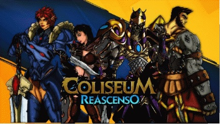
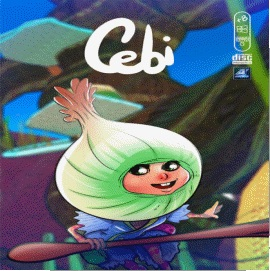
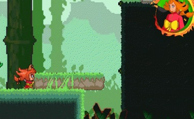
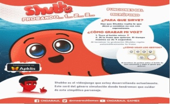
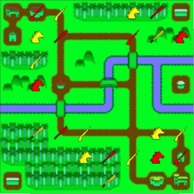
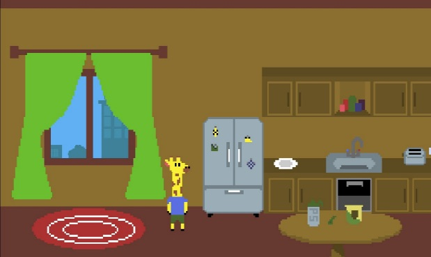
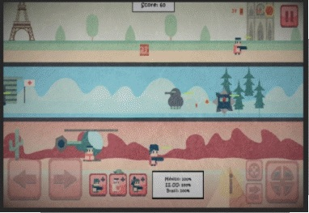

(Tomado de la [edición digital de JRebelde](https://www.juventudrebelde.cu/suplementos/informatica/2023-04-05/conoce-estos-diez-nuevos-videojuegos-cubanos))

El grupo temporal del Gobierno para la industria de videojuegos cubanos dio un paso más en su trabajo iniciado hace poco más de un año con el [lanzamiento este 4 de abril de una decena de títulos hechos en casa](https://lanzamiento2023.videojuegoscuba.org).

La jornada, realizada en el capitalino Pabellón Cuba, festejó los aniversarios 61 y 62 de la Unión de Jóvenes Comunistas y la Organización de Pioneros José Martí, respectivamente. Allí se dieron cita estudiantes de varias enseñanzas, además de académicos y desarrolladores, quienes disfrutaron de una feria, sesiones teóricas y un torneo de exhibición de Super Smash Bros.

Además de la UJC y la OPJM, el encuentro fue auspiciado por la Unión de Informáticos de Cuba, la Asociación Hermanos Saíz, la Universidad de las Ciencias Informáticas y las empresas Xetid y Citmatel.

Los invito a conocer una pincelada de los nuevos videojuegos, los cuales pueden ser descargados para sistema operativo Android a través de Apklis.

### Coliseum reascenso

La tercera entrega del popular juego de rol Coliseum llega de la mano de Vertex. Los desarrolladores recuerdan que es posible entablar combate con hasta seis jugadores en diversos modos como duelos, batallas por turnos, equipo contra todos y último en pie.

### Cebi

Citmatel ha creado a Cebi, un pequeño duende que habita en la cocina y es el personaje principal de esta aventura. Resulta que su pasatiempo favorito es cocinar y quiere preparar un sabroso postre, pero... ¿Qué se han hecho los ingredientes que necesita? Lo descubrirás si lo acompañas a recuperarlos, aunque ¡cuidado!, debes estar atento ante los obstáculos que encontrarás.

### Lucía’s Journey

Lucía’s Journey, de GeekZoneStudio, es un videojuego de género endless runner que busca concientizar sobre el acoso en las calles y el malestar sicológico que esto puede significar para las personas que son víctimas de ello. Con una perspectiva de género, es uno de los tres lanzamientos oficiales, junto a Cebi y Coliseum. Los demás juegos llegaron en fase beta.

### La leyenda de Honosume

Dywo Games ha creado un título de plataformas estilo pixel art, La Leyenda de Honosume, en el que el jugador debe hacer frente a múltiples enemigos y puzles para avanzar.

### Shubbo

El videojuego es una mascota virtual para dispositivos móviles. Usa diferentes características, como el micrófono, para que el personaje pueda repetir lo que dice el usuario. También es posible alimentarlo, disfrutar de minijuegos y darle medicina si se enferma. Shubbo ha sido creado por CNOARAUL Games.

### Battle Gear

Para los amantes de los juegos tipo «mecha», Battle Gear es ideal. Versus Windmills, el estudio detrás del juego, lo presenta de esta forma en la web videojuegoscuba.org: ¡Bienvenido a la Infantería Acorazada, el futuro de la guerra interplanetaria! Enfrenta a los enemigos de la Tierra (o de la corporación que administra la defensa) con tu avanzado sistema Gear. Adquiere renombre y, sobre todo, créditos para mejorar tu equipo y sobrevivir batallas cada vez más difíciles. Esta es la versión completa del juego, que incluye más de 20 niveles y nuevos enemigos. Por favor, reporte cualquier fallo a los desarrolladores.

### 1868

Andy Armas es un desarrollador que ha creado 1868, un videojuego de PC de estrategia por turnos que refleja las guerras independentistas cubanas en el siglo XIX. El jugador podrá liderar el Ejército Libertador cubano contra la metrópoli española basándose en el uso inteligente del terreno, los recursos y los diferentes tipos de unidades para combatir. Cuenta con un editor para crear mapas a la medida, una campaña y un modo de batalla rápida.

### Peter The Giraffe

Luife Games presenta Peter the Giraffe, una historia sobre una jirafa que vive en un pequeño pueblo, y su amigo la invita a su casa para probar su nuevo experimento. En el camino, Peter se encontrará con personajes únicos, algunos en problemas, y puede ayudarlos estirando el cuello.

De Luife también se dio a conocer Project G, un juego de acción en tercera persona donde puedes controlar la gravedad para escapar de una instalación de experimentos controlando a Roger, el protagonista.

### Casual Wars

Fatestudios games es el creador detrás de Casual Wars, un juego para dispositivos móviles del género Tower Defender, con elementos de acción. Según su argumento: «La humanidad ha sido atacada por aliens y sus terribles máquinas de metal. En tus manos está la última esperanza, solo tú puedes cerrar los portales. Pero no te descuides, pues si una sola de tus bases cae todo estará perdido. Organiza y ahorra tus recursos, no desperdicies munición, lidera a las tropas de la resistencia camino a la victoria».