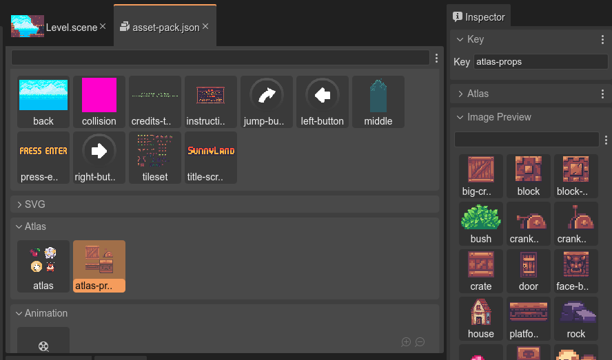
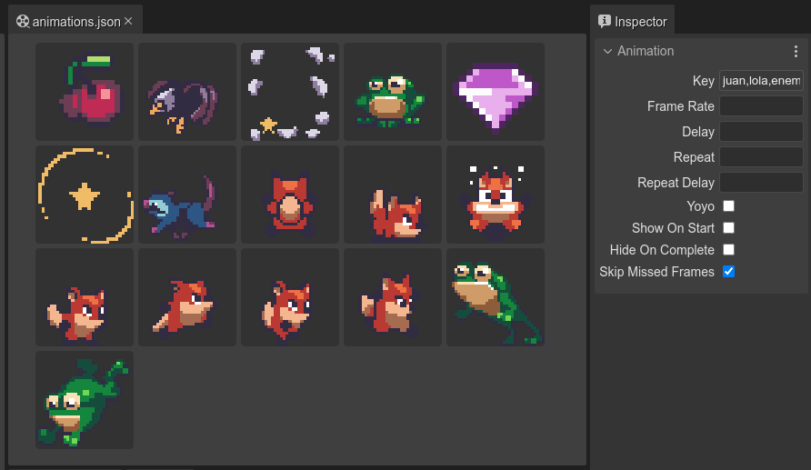
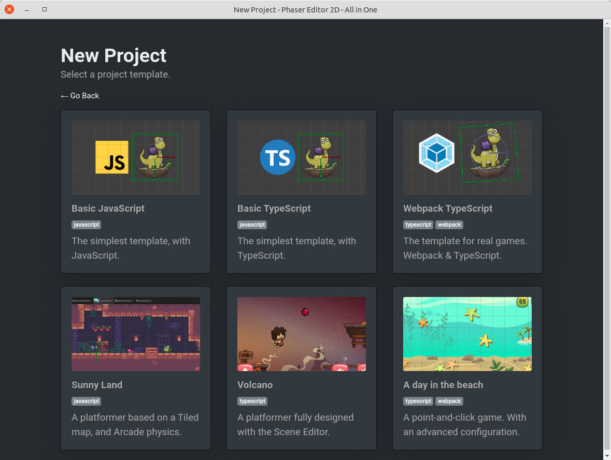

Phaser Editor 2D es un IDE para la creación de juegos basados en el popular framework [Phaser](https://phaser.io).

Visita nuestra web para mayor información: [phasereditor2d.com](https://phasereditor2d.com).

El editor es comercial, requiere de una licencia. Sin embargo, si eres cubano y consideras que puede ser útil para tus proyectos, te puedo brindar una licencia. Solo escríbeme a `arian@phasereditor2d.com` y cuéntame de tus proyectos.

Estas son algunas de las características fundamentales:

### Framework Phaser

Los juegos se basan en el framework [Phaser.io](https://phaser.io), ampliamente conocido en la comunidad de desarrolladores de juegos para la web.

### Editor de escenas

El [editor de escenas](https://help.phasereditor2d.com/v3/scene-editor/) permite, de una forma visual, armar niveles, interfaz gráficas y otro tipo de pantallas de forma visual.

Con ayuda de [prefabricados](https://help.phasereditor2d.com/v3/scene-editor/prefabs.html), [variantes de prefabricados](https://help.phasereditor2d.com/v3/scene-editor/prefab-variant.html), [prefabricados anidados](https://help.phasereditor2d.com/v3/scene-editor/prefab-nested.html) y [componentes de usuario](https://help.phasereditor2d.com/v3/scene-editor/user-components.html), puedes crear elementos reusables. Estos elementos lo mismo engloban conceptos gráficos que el comportamiento de los objetos del juego.

### Editor del empaquetador de recursos

El editor de **Asset Pack** te asiste de forma visual en el empaquetamiento de los recursos utilizados, como imágenes, sprite-sheets, mapas de texturas, audios, etc...

### Editor de animaciones

El editor de animaciones de sprites, permite empaquetar y visualizar las animaciones que se crean cuadro a cuadro.

### Editor de JavaScript

Para programar la lógica del juego, siempre es recomendable utilizar editores de código especializados, como Visual Studio Code. Sin embargo, la distribución *todo-en-uno* de Phaser Editor 2D incluye un editor de JavaScript con características avanzadas como auto-completamiento y *refactoring*.

### Plantilla de proyectos

Una ventaja de herramientas como estas es la facilidad para comenzar proyectos nuevos. Phaser Editor 2D permite provee algunas plantillas tanto para proyectos de prueba como para proyectos de juegos en producción.

### Listo para la nube

El editor está hecho de teconologías web y puede ser ejecutado lo mismo localmente como en la nube. La programación en la nube cada día es más utilizada y servicios como GitHub Codespaces y Gitpod van ganando en popularidad. Phaser Editor 2D Core permite ejecutar el editor en estos entornos.

[Crea un juego en la nube](https://phasereditor2d.com/start)