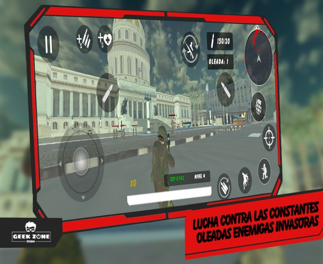
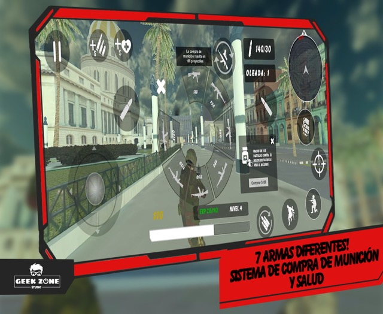
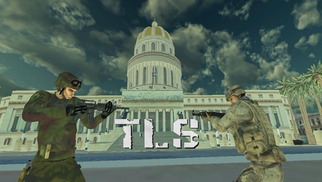

**En desarrollo**

La Gran Guerra ha estallado y nuestro país ha sido invadido, han venido a destruir nuestro hogar, eres el último soldado sobreviviente del batallón asignado al área del Capitolio de La Habana, nuevas oleadas de enemigos se aproximan para intentar eliminarte, tu misión es solo una: sobrevivir!

The Last Soldier es un survival shooter en 3ra persona ambientado en La Habana ganador de una beca de desarrollo otorgada en el 1er Festival de Realizadores de Videojuegos Cubanos, el juego nos pondrá en la piel de un soldado de las tropas especiales de Cuba el cual deberá hacer frente a las constantes oleadas de enemigos invasores, el objetivo es sobrevivir la mayor cantidad de oleadas posibles.

**Videojuego en fase Beta!**

Características del Juego:

- 7 armas diferentes
- Conducción de vehiculos
- Sistema de subida de experiencia y nivel
- Sistema de recompensas por kills
- Sistema de compra de munición y salud
- Ranking Nacional

Y muchos más por venir...

