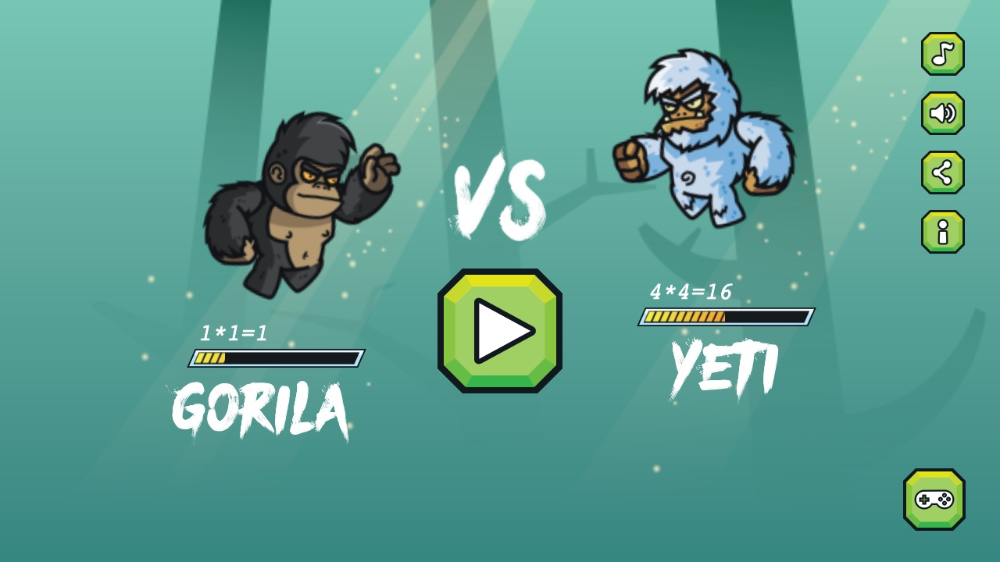
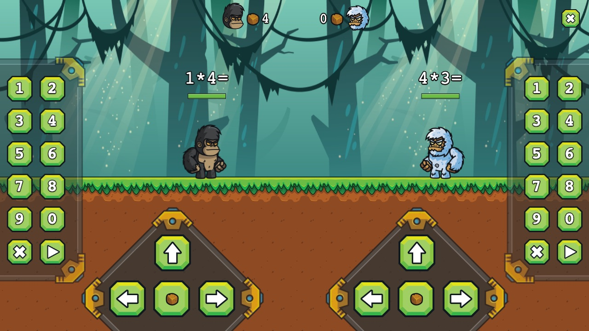
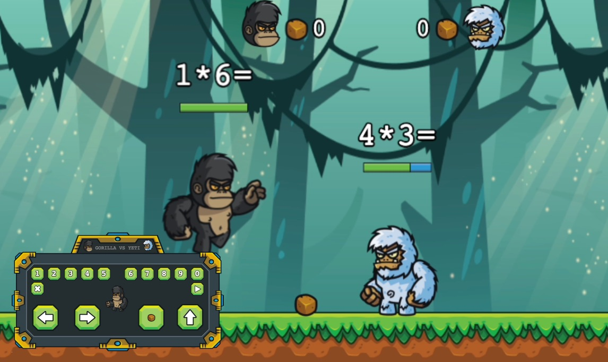
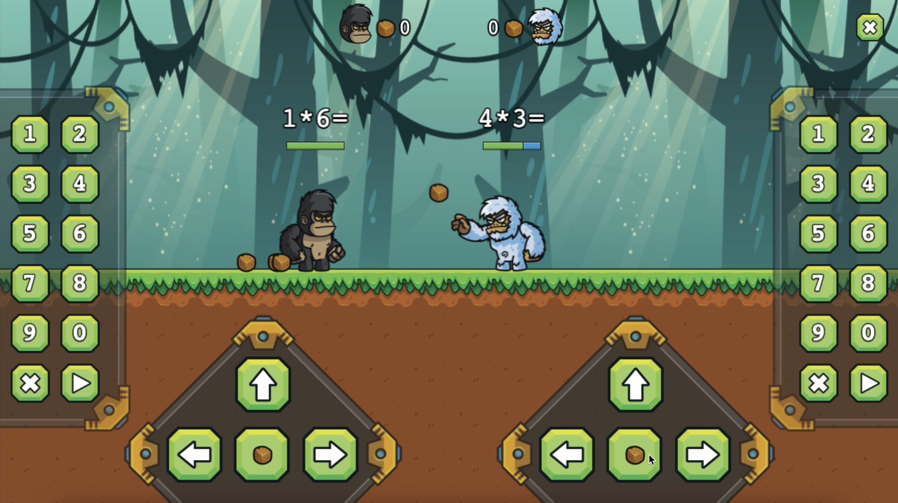
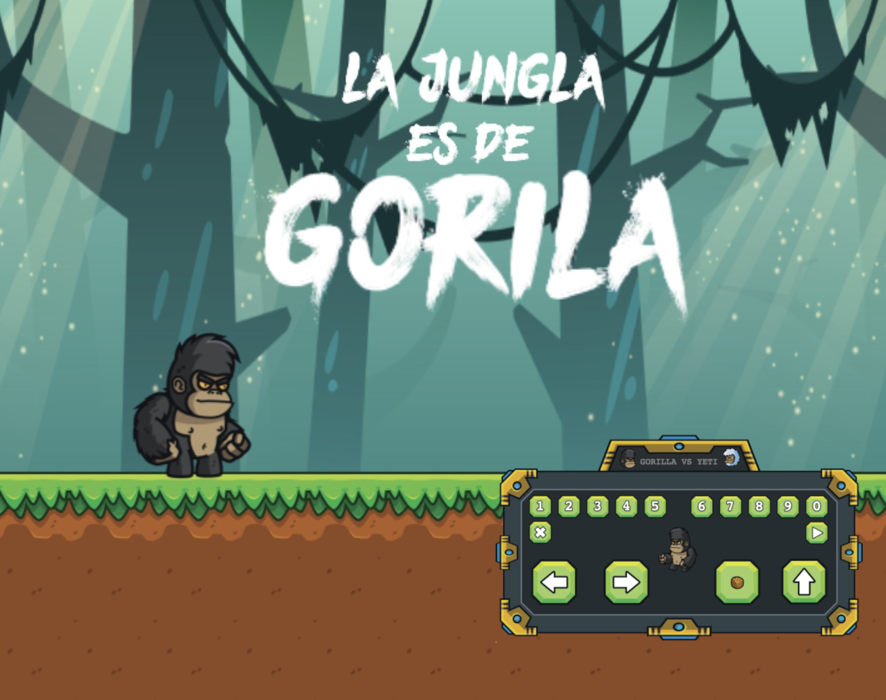
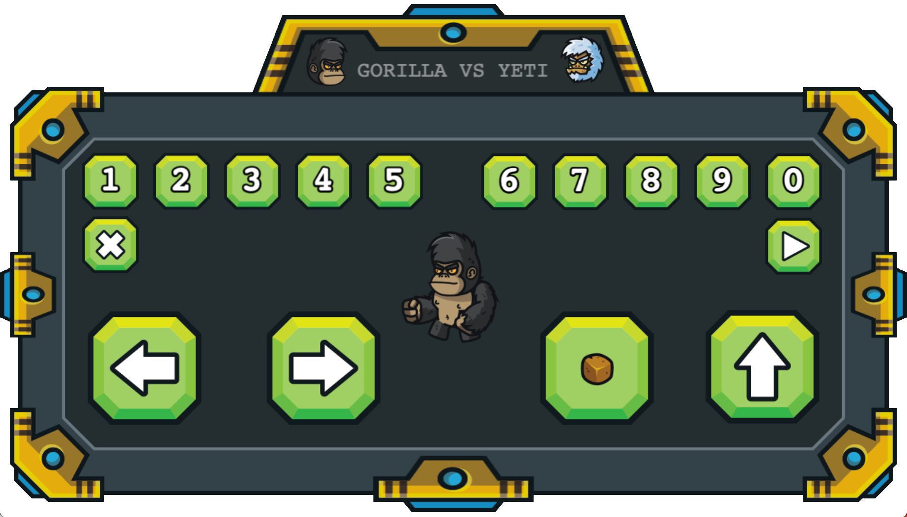

El juego "Gorila vs Yeti" es una herramienta educativa para que los niños aprendan las tablas de multiplicar mientras se divierten en familia. La diversión es parte fundamental del mismo. En el juego, dos jugadores se enfrentan en una pelea en la jungla, donde pueden lanzar piedras y tomar plátanos para recuperar energía, pero solo si resuelven correctamente operaciones de matemáticas. El juego está diseñado para que los jugadores elijan la tabla de multiplicación que desean practicar, y se puede conectar a otros teléfonos como mandos remotos.

[Conoce más sobre este juego en su sitio web](https://matandile.videojuegoscuba.org/gorila-vs-yeti/)

Estas son algunas capturas de pantalla:

