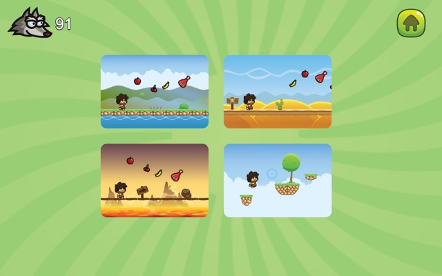
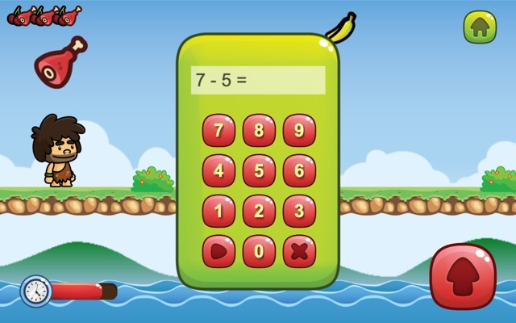
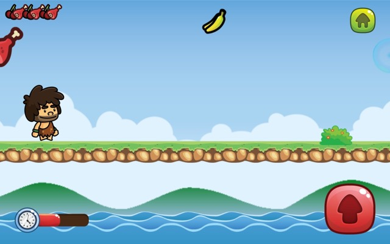
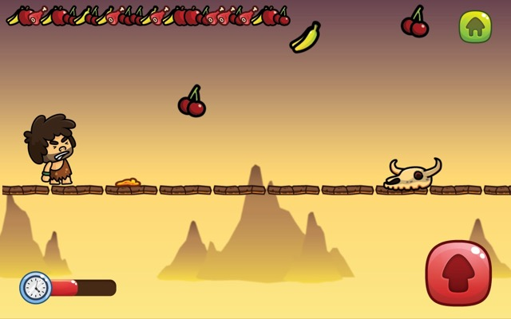

Juego para divertirnos mientras entrenamos las matemáticas. Destinado a los niños de primer grado. Se basa en el libro de texto de Matemática empleado en las escuelas cubanas. Especial para compartir un rato con los más pequeños de casa.

[Conoce más sobre este juego en su sitio web](https://matandile.videojuegoscuba.org/pedrito-cambolo/)

Estas son algunas capturas de pantalla:

